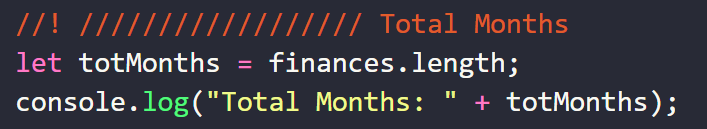
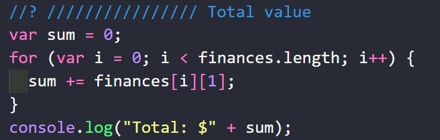
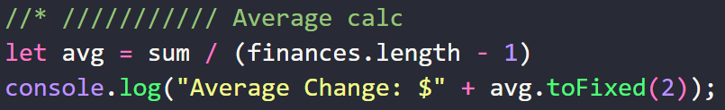
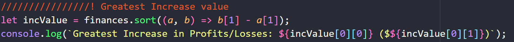
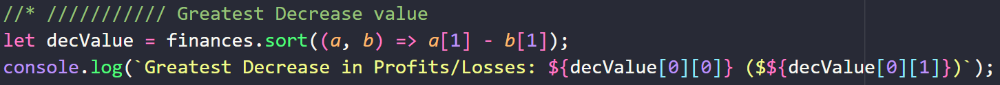

# Console Finance App

This repository contains a financial application(console App) that shows us: 

* ### Number of Months that exist in the analyzed report.
  
  

* ### Total Value.

  

* ### Average Value

  

* ### Highest Value/Month 

  

* ### Lowest Value/Month

  
